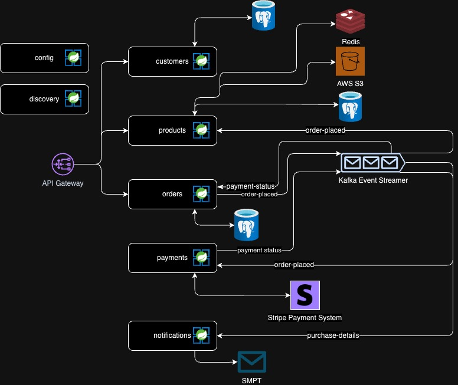
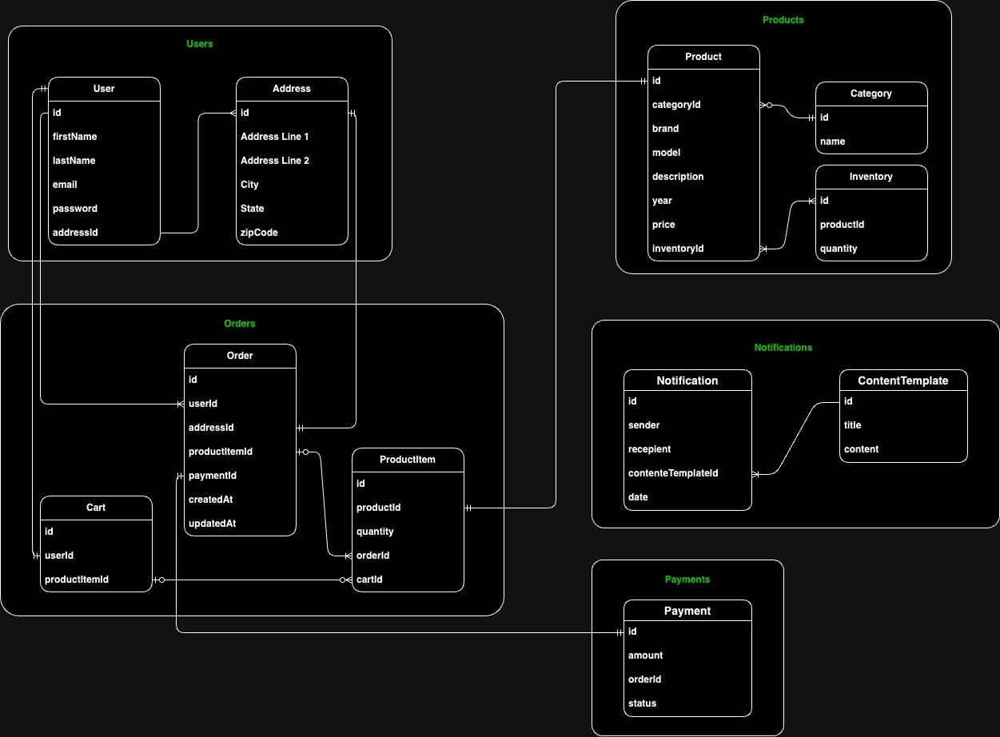

# E-commerce Microservices System
A Spring Boot-based microservices architecture for an e-commerce platform.

## Overview

### Key Components
- API Gateway: Routes client requests to appropriate services.
- Config & Discovery Services: Centralized configuration and service registry using Spring Cloud.
- Microservices:
  - Customer Service: Manages user profiles.
  - Product Service: Handles product catalog and inventory.
  - Order Service: Manages order creation and status.
  - Payment Service: Processes payments through Stripe.
  - Notification Service: Sends order and payment notifications via SMTP.
- Event Streaming: Kafka for asynchronous event handling (e.g., order and payment events).
- Caching: Redis for frequently accessed data.

### External Integrations
- Stripe: Secure payment processing.
- SMTP: Email notifications.

## Event Flow
- Order Placement: Publishes an order-placed event.
- Payment Processing: Listens for orders, processes payments with Stripe, and updates payment status.
- Order Confirmation: Listens for payments, and Publishes an order-confirmed event.
- Product Availability: Listens for orders, and Publishes an inventory-updated event.
- Notifications: Listens for order and payment events, and sends emails based on event statuses.

## Development Setup

To run the project, follow these steps:

- Clone the repository.
- Run `sh ./bin/setup` to build the project.
- It will start the following services:
  1. Config Service
  2. Discovery Service
  3. API Gateway
  4. Client Services:
     - Customer Service
     - Product Service
     - Order Service
     - Payment Service
     - Notification Service
